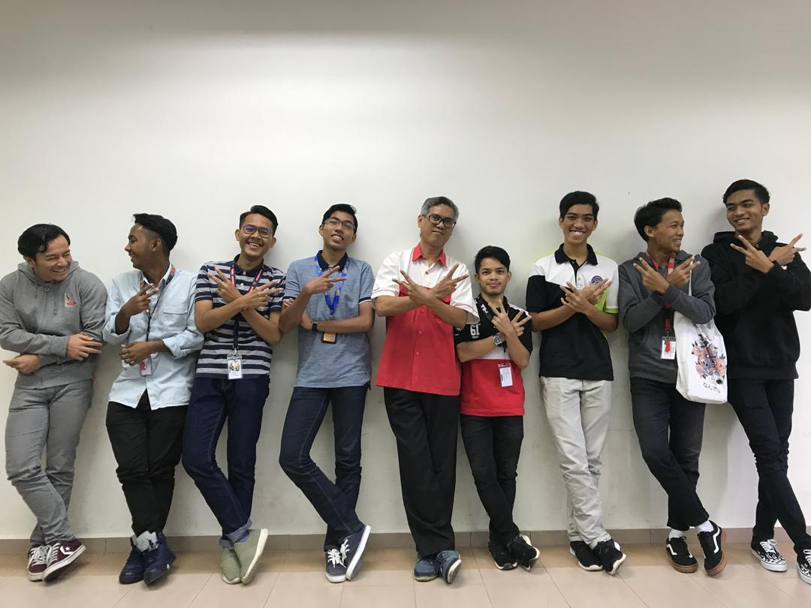
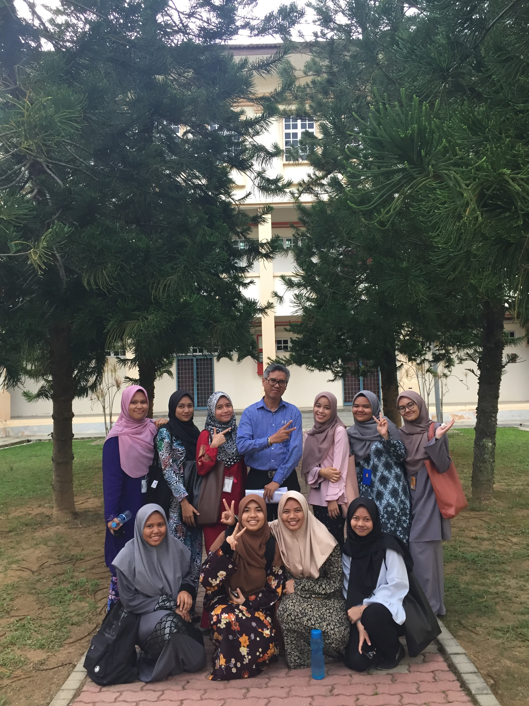

<link rel="stylesheet" href="styles.css" type="text/css">  
```{r, echo=FALSE, warning=FALSE, layout='l-screen'}

```  

***

**Office:** Academic Affairs Building, Room A2-1020  
**Office Hours:** Refer my class timetable for available slot for appointment.  

***  

**UNDERGRADUATE**  
 
|No.| Course Code | Course Name                                |  
|---|-------------|--------------------------------------------|  
|1. | MAT037      | Essential Mathematics                      |  
|2. | MAT111      | Mathematics with Business Applications     |  
|3. | MAT112      | Business Mathematics                       |  
|4. | MAT402      | Business Mathematics (Degree Level)        |  
|5. | QMT335      | Introduction to Time Series Forecasting    |  
|6. | QMT339      | Spreadsheet Modeling and Decision Analysis |  
  
---  


# **TIMETABLE**  

# {.tabset}  

## MAC 2019  

| TIME / DAY | Sunday | Monday | Tuesday | Wednesday | Thursday |  
|:----------:|:------:|:------:|:-------:|:---------:|:--------:|  
| 8 - 9 | STA104 (KAC1102F) | | | MAT112 (KAM1101R) | |  
| 9 - 10 | STA104 (KAC1102F) | | | MAT112 (KAM1101R) | |  
| 10 - 11 | | | | QMT181 (KBA1193A) | |  
| 11 - 12 | | | | QMT181 (KBA1193A) | |  
| 12 - 1 | MAT112 (KBA1111R1) | QMT181 (KBA1193A) | MAT112 (KAM1101R) | | |  
| 1 - 2 | MAT112 (KBA1111R1) | QMT181 (KBA1193A) | MAT112 (KAM1101R) | | |  
| 2 - 3 | | | | | |  
| 3 - 4 | | | | | |  
| 4 - 5 | | MAT112 (KBA1111R1) | STA104 (KAC1102F) | | |  
| 5 - 6 | | MAT112 (KBA1111R1) | STA104 (KAC1102F) | | |  

||  

***  

## SEPTEMBER 2019  

| TIME / DAY | Sunday | Monday | Tuesday | Wednesday | Thursday |  
|:----------:|:------:|:------:|:-------:|:---------:|:--------:|  
| 8 - 10 | MAT112 (KAM1101I) | MAT112 (KAM1101I)| | MAT112 (KAM1101J) | |  
| 10 - 12 | | MAT112 (KAC1101F) | MAT112 (KBA1191C) |  | MAT112 (KBA1191C) |  
| 12 - 2 | MAT112 (KBA1191F) |  | MAT112 (KBA1191F) | | MAT112 (KAC1101F) |  
| 2 - 4 | | | | | |  
| 4 - 6 | |  | MAT112 (KBA1101J) | | |  


||  

***

## OCT 2020 - FEB 2021 (20204)  

||  

***

##############################################
##############################################
##############################################

# **COURSE DETAILS**  

# {.tabset}

## MAT111 {.tabset}

### Course Information    
#### *Course Learning Outcomes*
At the end of the course, students should be able to:  
1. Solve basic mathematical problems. ( C3 A1 P2 )  
2. Apply mathematical concepts to solve mathematical problems in finance and banking. ( C4 A1 P2 )  
3. Apply mathematical concepts to solve mathematical problems in trading and retailing. ( C5 P2 A1 )  
  
   
#### *Course Description*
The course is primarily designed to strengthen the fundamental concepts of mathematics with emphasis on business
application and problem solving.  
  
  
#### *Syllabus Content*  
1. Fundamental Concepts Of Mathematics  
    a. Introduction to arithmetic operations  
    b. Linear Equations  
    c. Fractions, decimals, ratios and percentages  
2. Simple Interest  
    a. Simple Interest and Bank Discount  
    b. Present Value, Rate and Time  
    c. Applications of Simple Interest and Bank Discount
3. Compound Interest  
    a. Compound Interest and Compound Amount  
    b. Present Value  
    c. Applications of Compound Interest  
4. Business Loans and Instalment Purchase   
    a. Discounted Loan  
    b. Flat Rate Loan  
    c. Reducing Balance Loan  
    d. Instalment purchase  
5. Mathematics of Trading  
    a. Trade Discount  
    b. Single discount equivalent  
    c. Cash discount  
6. Mathematics of Retailing  
    a. Mark up and mark down  
    b. Gross profit, net profit and break even price  
  
  
#### *References*  
1. Lau Too Kya, Phang Yook Ngor and Wee Kok Kiang, Business Mathematics for UiTM, 4th, Oxford Fajar Sdn. Bhd., ISBN: 9789676571601.  
2. James Deitz,James Southam, Contemporary Business Mathematics for Colleges, 16th, Cengage Learning, 2012, ISBN: 1111821321.  
3. Jeffrey Slater,Sharon M. Wittry, Math for Business and Finance, McGraw-Hill, 2014, ISBN: 9780077662622.  
4. Stanley A. Salzman,Gary Clendenen, Mathematics for Business, 10th, Addison-Wesley Longman, 2012, ISBN: 9780132898355.  
  
  
#### *Course Assessment*  
Final examination – One 3-hour paper	: 60%  
Course Work (Continuous assessments) 	: 40%  
    - Test (3)	    : 30%  
    - Quizzes (4) 	: 10%  

***  

### Continuous Assessment Marks {.tabset}

#### KBA1111D  

**Continuous Assessment**
<details>

```{r results='asis', echo = FALSE, message=FALSE, warning = FALSE, dpi=1}
library(dplyr)
library(scales)
data_kba1181d <- readxl::read_excel("files/MAT111-KBA1181D.xls")

knitr::kable(data_kba1181d[ , -c(3,4)], caption = "Continuous Assessment (40%)") 
#  %>%  kable_styling()
```
</details>  


**Performance Summary** 
<details>

``` {r echo = FALSE}
data_summary <- summary(data_kba1181d[,c(5:12)])
knitr::kable(data_summary, caption = "Performance Summary")
```
</details>

##############################################
##############################################
##############################################

## MAT112 {.tabset}

### Course Information  

#### *Course Outcomes*  		
At the end of the course, students should be able to:  
•	Understand and describe mathematical terms encountered in business, finance and investment. (C2, P3, A3)  
•	Solve basic mathematical problems involving sequence. (C3, P3, A3)  
•	Apply mathematical concepts to solve mathematical problems in other areas such as business, statistics, finance, economics, etc. (C5, P3, A3)  
  
#### *Course Description*  
The course is primarily designed to develop the mathematical knowledge needed by the students to meet the demands of business operation.  It is to provide a solid coverage of the most basic and frequently occurring business situations.  
  
  
#### *Syllabus Content*  
1.   Sequence [Presentation](Sequence.html) [Download](files/slides/Sequence.pdf)  
      •	Introduction to sequence  
      •	Arithmetic sequence  
      •	Finding the nth term and the sum of the first n terms  
      •	Geometric sequence  
      •	Finding the nth term and the sum of the first n terms  
  
2.   Simple Interest [Presentation](Simple Interest.html) [Download](files/slides/Simple Interest.pdf)  
      •	Introduction to interest  
      •	Simple interest formula  
      •	Simple amount formula  
      •	Exact time and approximate time  
      •	Ordinary simple interest and exact simple interest  
      •	Banker’s Rule  
      •	Present Value  
  
3.   Bank Discount and Promissory Notes [Presentation](Promissory Note & Bank Discount.html) [Download](files/slides/Promissory Note & Bank Discount.pdf)    
      •	Introduction to promissory notes  
      •	Introduction to bank discount  
      •	Simple interest rate equivalent to bank discount rate  
  
4.    Compound Interest  
      •	Time value of money  
      •	Introduction to compound interest  
      •	Important terms use in compound interest  
      •	Compound interest formula  
      •	Present Value  
  
5.    Annuity   
      •	Introduction to annuity and types of annuities  
      •	Future value of ordinary annuity certain  
      •	Present value of ordinary annuity certain  
      •	Solving for R and n.  
  
6.    Installment Purchase  
      •	Introduction to installment purchase  
      •	Interest based on original balance  
      •	Interest based on reducing balance – constant ratio formula   
      •	Unpaid principal balance using Rule of 78  
  
7.   Trade and Cash Discounts  
      •	Introduction to trade discount  
      •	Net price formula  
      •	Chain discount  
      •	Single discount equivalent to chain discount  
      •	Cash discount  
  
8.   Mathematics of Retailing  
      •	Cost, selling price, profit, loss  
      •	Mark up and mark down  
      •	Profit and loss: Gross profit, net profit and breakeven price  
      •	Trade discount & Mathematics of retailing  
  
9.   Depreciation  
      •	Introduction to depreciation  
      •	Straight line method  
      •	Declining balance method  
  
  
#### *References*  
**Recommended Text**  
Lau Too Kya, Phang Yook Ngor and Wee Kok Kiang, Business Mathematics for UiTM 3rd edition, Fajar Bakti, 2009  

**References**  

Frank Ayers, Mathematics of Finance, Schaum Series, McGraw-Hill Book Company, 1997  
Charles D. Miller, Stanley A. Salzman, Gary Clendenen, Business Mathematics, 7th edition, Addision Wesley, 1997  
Deitz and Southam, Contemporary Business   Mathematics for Colleges, 12th edition, ITP, 1999.  
Mohd Alias Lazim, Azizah Murad, Wan Hartini Wan Hassan.  Matematik Perniagaan. Biroteks.  
  
  
#### *Course Assessment*  
Final examination – One 3-hour paper	: 60%  
Course Work (Continuous assessments) 	: 40%  
    - Test (2)	    : 30%  
    - Quizzes (3) 	:  6%  
    - Assignment (1):  4%  
  
### Support Materials

| Past Semester Exam Papers | Answer Scheme |  
|:-------------------------:|:-------------:|  
| [June 2019](files/support document/mat112/MAT112 June 2019.PDF) | [Answer Scheme June 2019](files/support document/mat112/MAT112 SKEMA JUNE 2019.pdf) |  
| [Dec 2018](files/support document/mat112/MAT112 Dec 2018.PDF) | [Answer Scheme Dec 2018](files/support document/mat112/MAT112 SKEMA DEC 2018.pdf) |  
| [Jan 2018](files/support document/mat112/MAT112 Jan 2018.PDF) | [Answer Scheme Jan 2018](files/support document/mat112/MAT112 SKEMA JAN 2018.pdf) |  


**Past Test Paper With Answers**  
[Test 2 Dec 2019](files/support document/mat112/Test 2 Dec 2019.pdf)  
[Test 1 Nov 2019](files/support document/mat112/Test 1 Nov 2019.pdf)  

**Workshops Questions With Answers**  
[Nov 2019 Session 1](files/support document/mat112/BENGKEL MAT112 NOV 2019 SESI 1.pdf) [Answers](files/support document/mat112/Answer MAT112 Workshop Nov 2019 Session 1.pdf)  

[Nov 2019 Session 2](files/support document/mat112/BENGKEL MAT112 NOV 2019 SESI 2.pdf) [Answers](files/support document/mat112/Answer MAT112 Workshop Nov 2019 Session 2.pdf)    


   
### Continuous Assessment Marks {.tabset}  

#### Semester 20192 {.tabset}

##### KBA1111E  
```{r results='asis', echo = FALSE, message=FALSE, warning = FALSE, dpi=1}
library(dplyr)
library(scales)
library(DT)
data_kba1111e <- readxl::read_excel("files/KBA1111E.xls")

knitr::kable(data_kba1111e[ , -c(3,4)], caption = "Continuous Assessment (40%)") 
#  %>%  kable_styling()
datatable(head(data_kba1111e[ , -c(3,4)], n = nrow(data_kba1111e[ , -c(3,4)])), options = list(pageLength = 5))
```

``` {r echo = FALSE}
data_summary <- summary(data_kba1111e[,c(5:9)])
knitr::kable(data_summary, caption = "Performance Summary")
```


``` {r echo = FALSE, message=FALSE, warning = FALSE, dpi=1}
library(jmv)
library(stargazer)

jmv::ttestIS(
    data = data_kba1111e,
    vars = c("Test 1", "Test 2", "Quiz", "Assignment", "CM"),
    group = "Jantina",
    hypothesis = "twoGreater",
    meanDiff = TRUE,
    effectSize = TRUE,
    desc = TRUE)
```  

| Gallery |     |  
|:-------:|:---:|
|||  
|||  

##### KBA1191C  
```{r results='asis', echo = FALSE, message=FALSE, warning = FALSE, dpi=1}
library(dplyr)
library(scales)
data_kba1191c <- readxl::read_excel("files/KBA1191C.xls")

knitr::kable(data_kba1191c[ , -c(3,4)], caption = "Continuous Assessment (40%)") 
#  %>%  kable_styling()
```

``` {r echo = FALSE}
data_summary <- summary(data_kba1191c[,c(5:9)])
knitr::kable(data_summary, caption = "Performance Summary")
```  

``` {r echo = FALSE, message=FALSE, warning = FALSE, dpi=1}
library(jmv)

jmv::ttestIS(
    data = data_kba1191c,
    vars = c("Test 1", "Test 2", "Quiz", "Assignment", "CM"),
    group = "Jantina",
    hypothesis = "twoGreater",
    meanDiff = TRUE,
    effectSize = TRUE,
    desc = TRUE)
```  

| Gallery |     |  
|:-------:|:---:|
|||  
|||  

##### KBA1191D  
```{r results='asis', echo = FALSE, message=FALSE, warning = FALSE, dpi=1}
library(dplyr)
library(scales)
data_kba1191d <- readxl::read_excel("files/KBA1191D.xls")

knitr::kable(data_kba1191d[ , -c(3,4)], caption = "Continuous Assessment (40%)") 
#  %>%  kable_styling()
```

``` {r echo = FALSE}
data_summary <- summary(data_kba1191d[,c(5:9)])
knitr::kable(data_summary, caption = "Performance Summary")
```  


``` {r echo = FALSE, message=FALSE, warning = FALSE, dpi=1}
library(jmv)

jmv::ttestIS(
    data = data_kba1191d,
    vars = c("Test 1", "Test 2", "Quiz", "Assignment", "CM"),
    group = "Jantina",
    hypothesis = "twoGreater",
    meanDiff = TRUE,
    effectSize = TRUE,
    desc = TRUE)
```  

| Gallery |     |  
|:-------:|:---:|
|||  
|||  

##### KAC1101E  
```{r results='asis', echo = FALSE, message=FALSE, warning = FALSE, dpi=1}
library(dplyr)
library(scales)
data_kac1101e <- readxl::read_excel("files/KAC1101E.xls")

knitr::kable(data_kac1101e[ , -c(3,4)], caption = "Continuous Assessment (40%)") 
#  %>%  kable_styling()
```

``` {r echo = FALSE}
data_summary <- summary(data_kac1101e[,c(5:9)])
knitr::kable(data_summary, caption = "Performance Summary")
```
  

``` {r echo = FALSE, message=FALSE, warning = FALSE, dpi = 1}
library(jmv)

jmv::ttestIS(
    data = data_kac1101e,
    vars = c("Test 1", "Test 2", "Quiz", "Assignment", "CM"),
    group = "Jantina",
    hypothesis = "twoGreater",
    meanDiff = TRUE,
    effectSize = TRUE,
    desc = TRUE)
```  

```{r eval=FALSE, message=FALSE, warning=FALSE, include=FALSE}
library(esquisse)

esquisse::esquisser(data = data_kac1101e)
```
  
#### Semester 20194 {.tabset}

##### KAC1101F
```{r results='asis', echo = FALSE, message=FALSE, warning = FALSE, dpi=1}
library(dplyr)
library(scales)
mat112_20194_kac1101f <- readxl::read_excel("files/20194/MAT112-KAC1101F.xlsx")

knitr::kable(mat112_20194_kac1101f[ , -c(3:4)], caption = "Continuous Assessment (40%)") 
#  %>%  kable_styling()
```

``` {r echo = FALSE}
data_summary <- summary(mat112_20194_kac1101f[,c(5:11)])
knitr::kable(data_summary, caption = "Performance Summary")
```


##### KAM1101I
```{r results='asis', echo = FALSE, message=FALSE, warning = FALSE, dpi=1}
library(dplyr)
library(scales)
mat112_20194_kam1101i <- readxl::read_excel("files/20194/MAT112-KAM1101I.xlsx")

knitr::kable(mat112_20194_kam1101i[ , -c(3:4)], caption = "Continuous Assessment (40%)") 
#  %>%  kable_styling()
```

``` {r echo = FALSE}
data_summary <- summary(mat112_20194_kam1101i[,c(5:11)])
knitr::kable(data_summary, caption = "Performance Summary")
```


##### KAM1101J
```{r results='asis', echo = FALSE, message=FALSE, warning = FALSE, dpi=1}
library(dplyr)
library(scales)
mat112_20194_kam1101j <- readxl::read_excel("files/20194/MAT112-KAM1101J.xlsx")

knitr::kable(mat112_20194_kam1101j[ , -c(3:4)], caption = "Continuous Assessment (40%)") 
#  %>%  kable_styling()
```

``` {r echo = FALSE}
data_summary <- summary(mat112_20194_kam1101j[,c(5:11)])
knitr::kable(data_summary, caption = "Performance Summary")
```


##### KBA1191B
```{r results='asis', echo = FALSE, message=FALSE, warning = FALSE, dpi=1}
library(dplyr)
library(scales)
mat112_20194_kba1191b <- readxl::read_excel("files/20194/MAT112-KBA1191B.xlsx")

knitr::kable(mat112_20194_kba1191b[ , -c(3:4)], caption = "Continuous Assessment (40%)") 
#  %>%  kable_styling()
```

``` {r echo = FALSE}
data_summary <- summary(mat112_20194_kba1191b[,c(5:11)])
knitr::kable(data_summary, caption = "Performance Summary")
```

##### KBA1191C
```{r results='asis', echo = FALSE, message=FALSE, warning = FALSE, dpi=1}
library(dplyr)
library(scales)
mat112_20194_kba1191c <- readxl::read_excel("files/20194/MAT112-KBA1191C.xlsx")

knitr::kable(mat112_20194_kba1191c[ , -c(3:4)], caption = "Continuous Assessment (40%)") 
#  %>%  kable_styling()
```

``` {r echo = FALSE}
data_summary <- summary(mat112_20194_kba1191c[,c(5:11)])
knitr::kable(data_summary, caption = "Performance Summary")
```


##### KBA1191F
```{r results='asis', echo = FALSE, message=FALSE, warning = FALSE, dpi=1}
library(dplyr)
library(scales)
mat112_20194_kba1191f <- readxl::read_excel("files/20194/MAT112-KBA1191F.xlsx")

knitr::kable(mat112_20194_kba1191f[ , -c(3:4)], caption = "Continuous Assessment (40%)") 
#  %>%  kable_styling()
```

``` {r echo = FALSE}
data_summary <- summary(mat112_20194_kba1191f[,c(5:11)])
knitr::kable(data_summary, caption = "Performance Summary")
```


#### Semester 20212 {.tabset}

##### KBA1111E  
```{r results='asis', echo = FALSE, message=FALSE, warning = FALSE, dpi=1}
library(dplyr)
library(scales)
library(DT)
data_20212_kba1111e <- readxl::read_excel("files/20212/MAT112_KBA1111E.xlsx")

# knitr::kable(data_20212_kba1111e[ , -3], caption = "Continuous Assessment (40%)") 
#  %>%  kable_styling()
datatable(head(data_20212_kba1111e[ , -3], n = nrow(data_20212_kba1111e[ , -3])), options = list(pageLength = 25))
```

##############################################
##############################################
##############################################

## QMT181/216/212/STA104 {.tabset}  

### Course Information  

#### *Course Learning Outcomes*  

At the end of the course, students should be able to:  
- Explain the concept, the use and the application of basic statistical tools in descriptive and inferential statistics. (C2)  
- Determine appropriate statistical solution and interpreting the real world problem. (C5)  
- Propose the use of descriptive statistics in the area of computing. (A3)  

#### *Course Description*  

This course introduces the basic statistical concepts in general applications. The topics include basic concepts of sampling methods, method of data collection, introductory methods in descriptive and inferential statistics. Specific topics include methods of describing data, correlation & regression analysis, time series analysis, index numbers and probability. Students will be exposed to statistical project which involve analyzing primary or secondary data in enhancing their understanding in solving real problems. Statistical Analysis using Excel or SPSS will be introduced.  

#### *Syllabus Content*  

1. Introduction to Statistics  
    - Definition of statistics  
    - Terms in statistics  
    - Types of statistics  
    - Sources of data  
    - Types of variable  
    - Scale of measurement  
    - Sampling techniques  
    - Data Collection Methods  
2. Describing Data  
    - Data organization and presentation  
    - Measures of Central Tendency  
    - Measures of Location  
    - Measures of Dispersion  
    - Measures of Skewness  
3. Correlation & Simple Linear Regression  
    - Correlation (Pearson’s Product Moment Correlation)  
    - Simple linear regression  
4. Index Numbers  
    - Types of index numbers  
    - Calculate and explain unweighted index numbers  
    - Calculate and explain weighted index number  
5. Time Series Analysis  
    - Component of time series  
    - Multiplicative time series model  
    - Trend Analysis (Moving Average Method)  
    - Seasonal Variations  
    - Forecasting  
6. Probability  
    - Set theory  
    - Addition rules  
    - Multiplication rules and conditional probability  
    - Counting Rules (Permutation and Combination)  
    - Tree Diagram  
    - Bayes’ Theorem  

#### *Teaching Methodology*  
Lectures, Tutorial, Discussion  

#### *Assessment*  

Test 1 (Topic 1 & 2) : 15% (CLO1 -15%)  
Test 2 (Topic 3 & 5) : 15% (CLO2- 15%)  
Quiz (Topic 4) : 5% (CLO2- 5%)  
Assignment (Topic 6 ) : 5% (CLO2 -5%)  
Group Project (Topic 1 & Topic 2) : 10% (CLO 3-10%)  
Final Examination : 50%  
  
| **ITEM**                            | **WEIGHT** | **REMARK **    |
|:-----------------------------------:|:----------:|:--------------:|
| Test 1 \(Topic 1 & 2\)              | 15%        | CLO1           |
| Test 2 \(Topic 3 & 5\)              | 15%        | CLO2           |
| Quiz \(Topic 4\)                    | 5%         | CLO2           |
| Assignment \(Topic 6\)              | 5%         | CLO2           |
| Group Project \(Topic 1 & Topic 2\) | 10%        | CLO3           |
| Final Examination                   | 50%        |                |  


#### *Recommended Text*  

1. Allan Bluman, Elementary Statistics: A Step By Step Approach, 8, McGraw-Hill Science/Engineering/Math, 2013, ISBN: 0073534986  

#### *References*  

1. William G Marchal, Samuel A Wathen Douglas A Lind, Statistical Techniques in Business and Economics - 13th Edition, 13, McGraw Hill Companies, 2007, ISBN: 9780070667075.  
2. Prem S. Mann, Introductory Statistics, 8, John Wiley & Sons, 2010, ISBN: 97804704446652.  
3. Muhammad Rozi, M & Faridah, A.H, Business Statistics, Oxford Fajar Bakti Sdn. Bhd, 2011, ISBN: 13-97898345093. 
4. Lau Too Kya, Phang Yook Ngor, Zainuddin Awang, Statistics for UiTM, 2, Penerbit Fajar Bakti Sdn. Bhd., 2009, ISBN: n/a  
5. Halilah Haron, Understanding Statistics with SPSS, 1, University Publication Center (UPENA), 2010, ISBN: 9789673631520.  

***  

### Scheme of Work  

<div class = "row">
<div class = "col-md-2">
<br>
Week 1  
</div>

<div class = "col-md-6">
<br>
**Topic 1: Introduction to Statistics**  

1. Definition of statistics  

2. Terms in statistics  
      - Population and sample  
      - Parameter and statistic  
      - Variable  
      - Census and sample survey (sampling)  
  
3. Types of statistics  
      - Descriptive statistics  
      - Inferential statistics  
  
4. Sources of data  
      - Primary data  
      - Secondary data  
  
5. Types of variable  
      - Qualitative data  
      - Quantitative data (Discrete and continuous)  
  
6. Scale of measurement  
      - Nominal  
      - Ordinal  
      - Interval  
      - Ratio  
</div>

<div class = "col-md-4">
<br>
**Remark:**  
Complete Entrance Survey  
[Slides](files/Introduction to Statistics.pdf)  
</div>
</div>
***  
<div class = "row">
<div class = "col-md-2">
Week 2  
</div>

<div class = "col-md-6">
7. Sampling techniques  

  a. Probability Sampling  
      - Simple random sampling (SRS)  
      - Systematic sampling  
      - Stratified sampling  
      - Cluster sampling  
      - Multistage sampling  
      
  b. Nonprobability Sampling  
      - Convenience sampling  
      - Quota sampling  
      
8. Data Collection Methods  
  a. Interview (Face to face and telephone)  
  b. Direct Observation  
  c. Questionnaire ( self administered, electronic media)  
  d. thers  
</div>

<div class = "col-md-4">
**Remark:**  
Define term of sampling unit and sampling frame.  

Emphasizing calculation on SRS, systematic and stratified sampling.  

Guidelines to construct the questionnaires.  
</div>
</div>
***  
<div class = "row">
<div class = "col-md-2">
Week 3
</div>

<div class = "col-md-6">
**Topic 2: Describing Data**  
Data organization and presentation  

1. Graphical method for qualitative data  
      - Frequency Distribution Table  
      - Pie Chart  
      - Bar chart (Cluster, Stacked)  
      - Cross tabulation  
      
2. Graphical method for quantitative data  
      - Frequency Distribution Table  
      - Stem and Leaf  
      - Histogram  
      - Frequency Polygon  
      - Ogive  
      
3. Types of distribution  

</div>

<div class = "col-md-4">
**Remarks:**
Constructing histogram and ogive using graph paper. (compulsory)  
</div>
</div>
***  
<div class = "row">
<div class = "col-md-2">
Week 4
</div>

<div class = "col-md-6">  
4. Numerical methods  

  a. Measure of central tendency for ungrouped and grouped  
      - Mean  
      - Median  
      - Mode  
</div>  

<div class = "col-md-4">
**Remarks:**  

Using calculator to obtain sample mean and standard deviation. (Substitute all the summation values into the respective formula)  

Interpret result from calculation. 
(Emphasizing the interpretation on mean, median, mode, skewness and coefficient variation)  
</div>
</div>
***  
<div class = "row">
<div class = "col-md-2">
Week 5
</div>

<div class = "col-md-6">
  b. Measure of position for ungrouped and grouped  
      - Q1, Q2 and Q3  
      - IQR  
      - Quartile deviation  
      - Box and whisker plot  
</div>

<div class = "col-md-4">
**Remarks:**  
</div>
</div>
***  
<div class = "row">
<div class = "col-md-2">
Week 6
</div>

<div class = "col-md-6">
  c. Measure of dispersion for ungrouped and grouped  
      - Range  
      - Variance  
      - Standard deviation  
  d. Coefficient of variation for ungrouped and grouped  
  e. Measure of skewness for ungrouped and grouped  
</div>

<div class = "col-md-4">
**Remarks:**  
Using calculator to obtain sample mean and standard deviation. (Substitute all the summation values into the respective formula)  
Interpret result from calculation. (Emphasizing the interpretation on mean, median, mode, skewness and coefficient variation)
</div>
</div>
***  
<div class = "row">
<div class = "col-md-2">
Week 7
</div>

<div class = "col-md-6">
**Topic 3: Correlation and Regression**  

1. Correlation  
    - Define dependent and independent variable  
    - Scatter Plot  
    - Pearson’s correlation coefficient **(exclude Spearman’s rank correlation coefficient)**  
</div>

<div class = "col-md-4">
**Remark:**  
Using calculator to obtain the Pearson’s Correlation Coefficient and Regression Line Equation by applying Least Square Method. (Substitute all the summation values into the respective formula)  
[Slides](files/CORRELATION AND REGRESSION.pdf)
</div>
</div>
***  

<div class = "row">
<div class = "col-md-2">
Week 8
</div>

<div class = "col-md-6">
**Topic 3: Correlation and Regression**  

1. Simple Linear Regression  
    - Least Squares Regression Line, $y=a+bx$  
    - Interpretation of $a$ and $b$  
    - Assumptions of the Regression Model  
    - Use of Regression Model For Prediction Purposes  
</div>

<div class = "col-md-4">
**Remark:**  
Using calculator Regression Line Equation by applying Least Square Method. (Substitute all the summation values into the respective formula)  
</div>
</div>
***  

<div class = "row">
<div class = "col-md-2">
Week 9
</div>

<div class = "col-md-6">
**Topic 4: Index Number**  

1. Types of index number  

2. Calculate and explain unweighted index number  
    - Simple Relative Index  
    - Simple Average Relative Index  
    - Simple Aggregate Index  

3. Calculate and explain weighted index number  
    - Weighted Index  
    - Laspeyres' Price and Quantity Index  
    - Paasche's Price and Quantity Index
</div>

<div class = "col-md-4">
**Remark:**  
[Slides](files/Topic 4 Chapter 8 - Index number Edited May 2021.pdf)
</div>
</div>
***  

### Group Project Guidelines  

**OBJECTIVES PROJECT:**  

The main objective of this project is to expose the students to the application of statistics techniques towards on the primary/secondary data. Besides that, to overview the students to the Final Year Project report nature.  

**OUTCOMES PROJECT**  

At the end of the project, students should be able:  
1. Describe the actual data.  
2. Explain and analyze the appropriate statistics techniques in analyzing the actual data.  
3. Produce a good class project report.  

#### **SUGGESTED GUIDELINES FOR PROJECT**  {.tabset}  

##### 1. GROUP MEMBERS  
Students are required to perform a group with 3 – 4 members. (The number of members per group depending on the number of students in the class and the number of class)  

***  

##### 2. SOURCE OF DATA  
Students are allowed to use primary / secondary data. There is no restricted on the number of sample size.  

***  

##### 3. COVER PAGE:  
Cover page should include UiTM logo, report title, name, student number and group.  

***  

##### 4. ACKNOWLEDGEMENT  

***  

##### 5. STANDARD TABLE OF CONTENT  

***  

##### 6. CONTENT OF PROJECT  

1. INTRODUCTION  
  1.1 Background of Study  
  1.2 Objectives of Study  
2. METHODOLOGY  
  2.1 Description of Data  
      - Population  
      - Sample  
      - Sampling technique  
      - Data Collection Method  
      - The descriptions on the variables (variable, types of variable and level measurement) are given as follow.  
      Example :
              Insert Image Here  
  2.2 Method of analysis (Topic 2)  
3. FINDINGS  
  It should include organizing and presenting data supported by numerical descriptive measures  
    - Use suitable chart/plot/table  
    - Comment the chart/plot/table  
4. FORMATTING  
    - Font : Arial, 11  
    - Spacing : 1.5  
    - Language : English Language  
    - Length report : Minimum 8 pages including cover page and report content  

***  

#### **DETAILS OF DATE SUBMISSION**  
Please ensure to submit the hardcopy and softcopy (burn in CD) **BEFORE OR ON WEEK 11.**  

***  

### Course Assessment {.tabset}  

#### Sem 20192 {.tabset}

##### KAC1102F  
```{r results='asis', echo = FALSE, message=FALSE, warning = FALSE, dpi=1}
library(dplyr)
library(scales)
data_kac1102f <- readxl::read_excel("files/20192/STA104-KAC1102F.xlsx")

knitr::kable(data_kac1102f[ , -c(3:4,11:15)], caption = "Continuous Assessment (40%)") 
#  %>%  kable_styling()
```

``` {r echo = FALSE}
data_summary <- summary(data_kac1102f[,c(5:10)])
knitr::kable(data_summary, caption = "Performance Summary")
```
  

``` {r echo = FALSE, message=FALSE, warning = FALSE, dpi = 1}
library(jmv)

jmv::ttestIS(
    data = data_kac1102f,
    vars = c("Test 1", "Test 2", "Quiz", "Assign", "Total (50%)"),
    group = "Jantina",
    hypothesis = "twoGreater",
    meanDiff = TRUE,
    effectSize = TRUE,
    desc = TRUE)
```  

##### KBA1193A  
```{r results='asis', echo = FALSE, message=FALSE, warning = FALSE, dpi=1}
library(dplyr)
library(scales)
data_kba1193a <- readxl::read_excel("files/20192/QMT181-KBA1193A.xlsx")

knitr::kable(data_kba1193a[ , -c(3:4,11:15)], caption = "Continuous Assessment (40%)") 
#  %>%  kable_styling()
```

``` {r echo = FALSE}
data_summary <- summary(data_kba1193a[,c(5:10)])
knitr::kable(data_summary, caption = "Performance Summary")
```
  

``` {r echo = FALSE, message=FALSE, warning = FALSE, dpi = 1}
library(jmv)

jmv::ttestIS(
    data = data_kba1193a,
    vars = c("Test 1", "Test 2", "Quiz", "Assign", "Total (50%)"),
    group = "Jantina",
    hypothesis = "twoGreater",
    meanDiff = TRUE,
    effectSize = TRUE,
    desc = TRUE)
```  

##### KBA1193A-1  
```{r results='asis', echo = FALSE, message=FALSE, warning = FALSE, dpi=1}
library(dplyr)
library(scales)
data_kba1193a_1 <- readxl::read_excel("files/20192/QMT181-KBA1193A-1.xlsx")

knitr::kable(data_kba1193a_1[ , -c(3:4)], caption = "Continuous Assessment (40%)") 
#  %>%  kable_styling()
```

``` {r echo = FALSE}
data_summary <- summary(data_kba1193a_1[,c(5:10)])
knitr::kable(data_summary, caption = "Performance Summary")
```
  

```{undefined eval=FALSE, include=FALSE}
library(jmv)

jmv::ttestIS(
    data = data_kba1193a_1,
    vars = c("Test 1", "Test 2", "Quiz", "Assign", "Total (50%)"),
    group = "Jantina",
    hypothesis = "twoGreater",
    meanDiff = TRUE,
    effectSize = TRUE,
    desc = TRUE)
```  

***  
