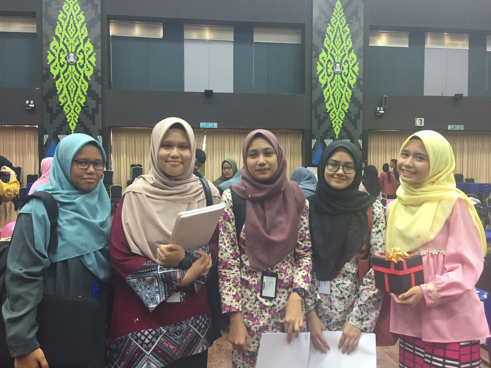

<link rel="stylesheet" href="styles.css" type="text/css">  

# {.tabset}

## MAT111 {.tabset}

### Course Information    
#### *Course Learning Outcomes*
At the end of the course, students should be able to:  
1. Solve basic mathematical problems. ( C3 A1 P2 )  
2. Apply mathematical concepts to solve mathematical problems in finance and banking. ( C4 A1 P2 )  
3. Apply mathematical concepts to solve mathematical problems in trading and retailing. ( C5 P2 A1 )  
  
   
#### *Course Description*
The course is primarily designed to strengthen the fundamental concepts of mathematics with emphasis on business
application and problem solving.  
  
  
#### *Syllabus Content*  
1. Fundamental Concepts Of Mathematics  
    a. Introduction to arithmetic operations  
    b. Linear Equations  
    c. Fractions, decimals, ratios and percentages  
2. Simple Interest  
    a. Simple Interest and Bank Discount  
    b. Present Value, Rate and Time  
    c. Applications of Simple Interest and Bank Discount
3. Compound Interest  
    a. Compound Interest and Compound Amount  
    b. Present Value  
    c. Applications of Compound Interest  
4. Business Loans and Instalment Purchase   
    a. Discounted Loan  
    b. Flat Rate Loan  
    c. Reducing Balance Loan  
    d. Instalment purchase  
5. Mathematics of Trading  
    a. Trade Discount  
    b. Single discount equivalent  
    c. Cash discount  
6. Mathematics of Retailing  
    a. Mark up and mark down  
    b. Gross profit, net profit and break even price  
  
  
#### *References*  
1. Lau Too Kya, Phang Yook Ngor and Wee Kok Kiang, Business Mathematics for UiTM, 4th, Oxford Fajar Sdn. Bhd., ISBN: 9789676571601.  
2. James Deitz,James Southam, Contemporary Business Mathematics for Colleges, 16th, Cengage Learning, 2012, ISBN: 1111821321.  
3. Jeffrey Slater,Sharon M. Wittry, Math for Business and Finance, McGraw-Hill, 2014, ISBN: 9780077662622.  
4. Stanley A. Salzman,Gary Clendenen, Mathematics for Business, 10th, Addison-Wesley Longman, 2012, ISBN: 9780132898355.  
  
  
#### *Course Assessment*  
Final examination – One 3-hour paper	: 60%  
Course Work (Continuous assessments) 	: 40%  
    - Test (3)	    : 30%  
    - Quizzes (4) 	: 10%  


### Continuous Assessment Marks {.tabset}

#### KBA1111D  
```{r results='asis', echo = FALSE, message=FALSE, warning = FALSE, dpi=1}
library(dplyr)
library(scales)
data_kba1181d <- readxl::read_excel("files/MAT111-KBA1181D.xls")

knitr::kable(data_kba1181d[ , -c(3,4,8,9)], caption = "Continuous Assessment (40%)") 
#  %>%  kable_styling()
```

``` {r echo = FALSE}
data_summary <- summary(data_kba1181d[,c(5:12)])
knitr::kable(data_summary, caption = "Performance Summary")
```

## MAT112 {.tabset}

### Course Information  

#### *Course Outcomes*  		
At the end of the course, students should be able to:  
•	Understand and describe mathematical terms encountered in business, finance and investment. (C2, P3, A3)  
•	Solve basic mathematical problems involving sequence. (C3, P3, A3)  
•	Apply mathematical concepts to solve mathematical problems in other areas such as business, statistics, finance, economics, etc. (C5, P3, A3)  
  
#### *Course Description*  
The course is primarily designed to develop the mathematical knowledge needed by the students to meet the demands of business operation.  It is to provide a solid coverage of the most basic and frequently occurring business situations.  
  
  
#### *Syllabus Content*  
1.   Sequence  
      •	Introduction to sequence  
      •	Arithmetic sequence  
      •	Finding the nth term and the sum of the first n terms  
      •	Geometric sequence  
      •	Finding the nth term and the sum of the first n terms  
  
2.   Simple Interest  
      •	Introduction to interest  
      •	Simple interest formula  
      •	Simple amount formula  
      •	Exact time and approximate time  
      •	Ordinary simple interest and exact simple interest  
      •	Banker’s Rule  
      •	Present Value  
  
3.   Bank Discount and Promissory Notes  
      •	Introduction to promissory notes  
      •	Introduction to bank discount  
      •	Simple interest rate equivalent to bank discount rate  
  
4.    Compound Interest  
      •	Time value of money  
      •	Introduction to compound interest  
      •	Important terms use in compound interest  
      •	Compound interest formula  
      •	Present Value  
  
5.    Annuity   
      •	Introduction to annuity and types of annuities  
      •	Future value of ordinary annuity certain  
      •	Present value of ordinary annuity certain  
      •	Solving for R and n.  
  
6.    Installment Purchase  
      •	Introduction to installment purchase  
      •	Interest based on original balance  
      •	Interest based on reducing balance – constant ratio formula   
      •	Unpaid principal balance using Rule of 78  
  
7.   Trade and Cash Discounts  
      •	Introduction to trade discount  
      •	Net price formula  
      •	Chain discount  
      •	Single discount equivalent to chain discount  
      •	Cash discount  
  
8.   Mathematics of Retailing  
      •	Cost, selling price, profit, loss  
      •	Mark up and mark down  
      •	Profit and loss: Gross profit, net profit and breakeven price  
      •	Trade discount & Mathematics of retailing  
  
9.   Depreciation  
      •	Introduction to depreciation  
      •	Straight line method  
      •	Declining balance method  
  
  
#### *References*  
**Recommended Text**  
Lau Too Kya, Phang Yook Ngor and Wee Kok Kiang, Business Mathematics for UiTM 3rd edition, Fajar Bakti, 2009  

**References**  

Frank Ayers, Mathematics of Finance, Schaum Series, McGraw-Hill Book Company, 1997  
Charles D. Miller, Stanley A. Salzman, Gary Clendenen, Business Mathematics, 7th edition, Addision Wesley, 1997  
Deitz and Southam, Contemporary Business   Mathematics for Colleges, 12th edition, ITP, 1999.  
Mohd Alias Lazim, Azizah Murad, Wan Hartini Wan Hassan.  Matematik Perniagaan. Biroteks.  
  
  
#### *Course Assessment*  
Final examination – One 3-hour paper	: 60%  
Course Work (Continuous assessments) 	: 40%  
    - Test (2)	    : 30%  
    - Quizzes (3) 	:  6%  
    - Assignment (1):  4%  
  
  
### Continuous Assessment Marks {.tabset}  

#### KBA1111E  
```{r results='asis', echo = FALSE, message=FALSE, warning = FALSE, dpi=1}
library(dplyr)
library(scales)
data_kba1111e <- readxl::read_excel("files/KBA1111E.xls")

knitr::kable(data_kba1111e[ , -c(3,4,7)], caption = "Continuous Assessment (40%)") 
#  %>%  kable_styling()
```

``` {r echo = FALSE}
data_summary <- summary(data_kba1111e[,c(5:9)])
knitr::kable(data_summary, caption = "Performance Summary")
```


``` {r echo = FALSE, message=FALSE, warning = FALSE, dpi=1}
library(jmv)

jmv::ttestIS(
    data = data_kba1111e,
    vars = c("Test 1", "Test 2", "Assignment", "CM"),
    group = "Jantina",
    hypothesis = "twoGreater",
    meanDiff = TRUE,
    effectSize = TRUE,
    desc = TRUE)
```  

| Gallery |     |  
|:-------:|:---:|
|||  
|||  

#### KBA1191C  
```{r results='asis', echo = FALSE, message=FALSE, warning = FALSE, dpi=1}
library(dplyr)
library(scales)
data_kba1191c <- readxl::read_excel("files/KBA1191C.xls")

knitr::kable(data_kba1191c[ , -c(3,4,7)], caption = "Continuous Assessment (40%)") 
#  %>%  kable_styling()
```

``` {r echo = FALSE}
data_summary <- summary(data_kba1191c[,c(5:9)])
knitr::kable(data_summary, caption = "Performance Summary")
```  

``` {r echo = FALSE, message=FALSE, warning = FALSE, dpi=1}
library(jmv)

jmv::ttestIS(
    data = data_kba1191c,
    vars = c("Test 1", "Test 2", "Assignment", "CM"),
    group = "Jantina",
    hypothesis = "twoGreater",
    meanDiff = TRUE,
    effectSize = TRUE,
    desc = TRUE)
```  

| Gallery |     |  
|:-------:|:---:|
|||  
|||  

#### KBA1191D  
```{r results='asis', echo = FALSE, message=FALSE, warning = FALSE, dpi=1}
library(dplyr)
library(scales)
data_kba1191d <- readxl::read_excel("files/KBA1191D.xls")

knitr::kable(data_kba1191d[ , -c(3,4,7)], caption = "Continuous Assessment (40%)") 
#  %>%  kable_styling()
```

``` {r echo = FALSE}
data_summary <- summary(data_kba1191d[,c(5:9)])
knitr::kable(data_summary, caption = "Performance Summary")
```  


``` {r echo = FALSE, message=FALSE, warning = FALSE, dpi=1}
library(jmv)

jmv::ttestIS(
    data = data_kba1191d,
    vars = c("Test 1", "Test 2", "Assignment", "CM"),
    group = "Jantina",
    hypothesis = "twoGreater",
    meanDiff = TRUE,
    effectSize = TRUE,
    desc = TRUE)
```  

| Gallery |     |  
|:-------:|:---:|
|||  
|||  

#### KAC1101E  
```{r results='asis', echo = FALSE, message=FALSE, warning = FALSE, dpi=1}
library(dplyr)
library(scales)
data_kac1101e <- readxl::read_excel("files/KAC1101E.xls")

knitr::kable(data_kac1101e[ , -c(3,4,7)], caption = "Continuous Assessment (40%)") 
#  %>%  kable_styling()
```

``` {r echo = FALSE}
data_summary <- summary(data_kac1101e[,c(5:9)])
knitr::kable(data_summary, caption = "Performance Summary")
```
  

``` {r echo = FALSE, message=FALSE, warning = FALSE, dpi=1}
library(jmv)

jmv::ttestIS(
    data = data_kac1101e,
    vars = c("Test 1", "Test 2", "Assignment", "CM"),
    group = "Jantina",
    hypothesis = "twoGreater",
    meanDiff = TRUE,
    effectSize = TRUE,
    desc = TRUE)
```  

